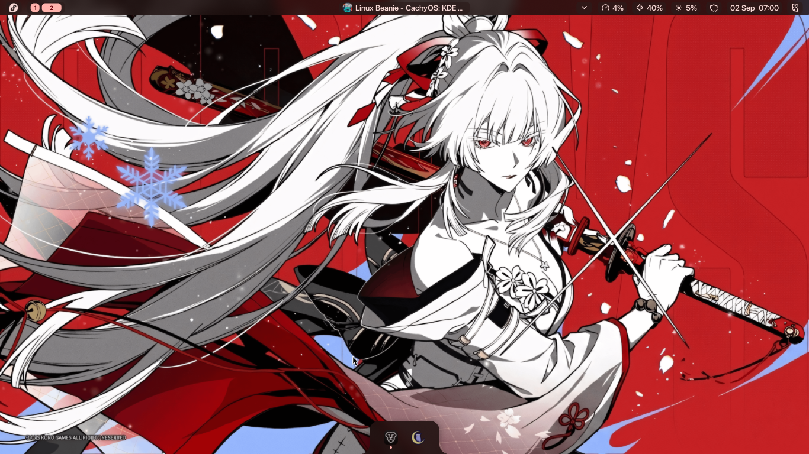

# Fedora Minimal — Niri + Noctalia Shell + macOS Aesthetic Dotfiles



Repository dotfiles & automated deployment script untuk lingkungan desktop Wayland minimalis, modern, dan elegan berbasis **Fedora Minimal / Everything**, **Niri Compositor**, dan **Noctalia Shell v5**.

---

## ✨ Features & Setup Overview

* **Compositor**: [Niri](https://github.com/YaLTeR/niri) (Scrollable-tiling Wayland compositor, Spring physics, Gaps 5px, Borderless, Click-to-focus, CSD disabled).
* **Shell & Top Bar**: [Noctalia Shell v5](https://noctalia.dev) (Single top bar 26px, Capsule pills, Live CPU sysmon, Tray drawer, Network signal & Clock, Control Center).
* **Dock**: Minimalist bottom floating dock with auto-hide (`enabled = true`, `smart_auto_hide = true`).
* **Theming**: Dynamic Material You palette (`m3-content`) extracted from wallpaper + Catppuccin & Tokyo-Night high contrast support.
* **App Auto-Theming**: Alacritty, GTK 3/4, Niri, dan Starship otomatis tersinkronisasi warnanya dengan wallpaper.
* **Typography**:
  * UI: **Apple SF Pro Display 11**
  * Documents: **Apple SF Pro Text 11**
  * Monospace / Terminal: **Apple SF Mono 11**
  * International & CJK: Google Noto Sans/Serif CJK, Noto Color Emoji, Symbols, Asian Scripts suite.
* **Icons & Cursor**:
  * Icons: **WhiteSur-dark** (macOS Big Sur / Sequoia style squircle icons).
  * Cursor: **macOS Cursors 22px** (`macOS` official pointer).
* **Terminal & Shell**:
  * Terminal: **Alacritty** (Borderles, 85% opacity, SF Mono, Noctalia live color sync).
  * Shell: **Zsh** + **Starship Prompt** (Catppuccin 2-line prompt) + Fastfetch compact system info on launch + Auto-suggestions & Syntax-highlighting.
* **Power & Idle Automation**:
  * **swayidle**: Auto-lock screen at 5 min, Screen DPMS off at 6 min (wakes on input), Auto-suspend at 15 min, lock before sleep.
* **Privilege & Network**:
  * Polkit rule untuk NetworkManager Wi-Fi scanning tanpa prompt password admin.

---

## 📂 Repository Structure

```text
.
├── .config/
│   ├── alacritty/
│   │   └── alacritty.toml          # Alacritty terminal config
│   ├── fastfetch/
│   │   └── config.jsonc            # Compact fastfetch system spec format
│   ├── gtk-3.0/
│   │   └── settings.ini            # GTK 3 SF Pro & WhiteSur settings
│   ├── gtk-4.0/
│   │   └── settings.ini            # GTK 4 SF Pro & WhiteSur settings
│   ├── niri/
│   │   └── config.kdl              # Niri WM layout, binds, cursor, animations
│   ├── noctalia/
│   │   ├── config.toml             # Noctalia top bar & widget layout
│   │   ├── icons/
│   │   │   └── fedora.svg          # Simple-icons Fedora monochrome launcher logo
│   │   └── palettes/
│   │       └── CatppuccinCustom.json # High-contrast tooltip/popover palette
│   └── starship.toml               # Catppuccin prompt configuration
├── .local/
│   └── state/
│       └── noctalia/
│           └── settings.toml       # Noctalia UI runtime state (dock, wallpapers, schemes)
├── pictures/
│   └── walls/
│       ├── wallpaper.png           # Default 4K desktop wallpaper
│       └── avatar.jpg              # Lockscreen / profile picture
├── .zshrc                          # Zsh configuration, aliases, plugins
├── install.sh                      # One-liner automated installation script
└── README.md
```

---

## 🚀 One-Line Installation

Jalankan perintah ini di instalasi baru Fedora (Workstation / Minimal / Everything):

```bash
bash <(curl -fsSL https://raw.githubusercontent.com/rodwell311/fedora-niri-noctalia/main/install.sh)
```

Atau clone repo secara manual:

```bash
git clone https://github.com/rodwell311/fedora-niri-noctalia.git ~/dotfiles
cd ~/dotfiles
chmod +x install.sh
./install.sh
```

---

## ⌨️ Keybindings Reference

| Shortcut | Action |
| :--- | :--- |
| `Mod + Return` | Buka Terminal (**Alacritty** + Zsh) |
| `Mod + B` | Buka Web Browser (**Brave Origin**) |
| `Mod + E` | Buka File Manager GUI (**Nautilus**) |
| `Mod + Space` | Buka Application Launcher (**Noctalia**) |
| `Mod + V` | Buka Clipboard Manager History (**Noctalia**) |
| `Mod + Escape` | Buka Power & Session Menu (**Noctalia**) |
| `Mod + Shift + Return` | Buka Wallpaper Picker (**Noctalia**) |
| `Mod + Q` | Tutup Window Aktif |
| `Mod + Left / Right` | Fokus Kolom Kiri / Kanan |
| `Mod + Shift + Left / Right` | Pindahkan Kolom Window ke Kiri / Kanan |
| `Mod + 1 .. 9` | Pindah ke Workspace 1 .. 9 |
| `Mod + Shift + 1 .. 9` | Pindahkan Window ke Workspace 1 .. 9 |
| `Ctrl + Alt + Escape` | Toggle Keyboard Shortcuts Inhibitor |
